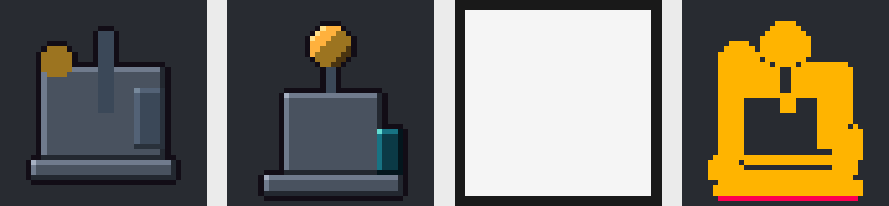

# PGA A/D Benchmark v1.2 scored 独立终审

日期：2026-09-29。审计基线：`master`，`87db710223d84b359a0ccc7aecda27eab4c886c9`。

## 结论

**数值汇总可以从原始文件复现，但不能无条件认证整份最终报告。** A 17/18、D 14/18 和 7/2/7/2 是按原始 `taskFit` 字段、接受两次机械 fallback、并沿用主持人“工具/预算合规”声明得到的正确算术。正文有可证实的错误；动画总判定与协议认证存在缺口。不能把这组数写成“全部要求已独立验证的成功率”。

未发现源版本混用、错误解盲、隐去其他技术失败或现存记录中替换失败 run 的证据。不具备完整宿主轨迹，故不能证明从未删除历史运行、没有提前读取 key、实际模型与隔离全程不变。现有问题不要求抹掉整批资产、技术结果和原始评审，但足以否定“协议完全执行且报告所有解释均可靠”的无保留结论。

严谨结论是：本次 6 项任务、3 次重复、GLM-5.3-Flash/ZCode 自报条件与 12 状态预算下，**没有观察到 D 的整体优势**。数据也不足以证明 A 在总体上优于 D，更不支持推广到所有 2D 资产或商业级美术。两种指定敏感性分析没有反转方向，但改变了成功计数及可比较 pair 数量。

## 方法与不可变边界

- 阅读 `AGENTS.md`、`CONTEXT.md`、ADR-0001/0008/0009/0010/0011、冻结 preregistration、任务、提示词和分析实现。
- 独立脚本为 `recompute.mjs`，未导入或执行原 `gen-analysis.mjs`。先按 36 份 `technical.json` 重建，再从最终源各重渲染两次，以原始 RGBA 和 allowed-mask 逐像素核验；使用既有冻结烘焙核心，不新造渲染器。
- 从 18 份 key、36 份 review 独立解盲，并重新计算 seed 映射、比对全部匿名 PNG、compare.html、起点及公共材料；没有重跑 participant/reviewer。
- 对 92 份 D candidate 重新执行原始 operation 的纯函数推导、编译、身份与 protection 校验；核对 revision 链和最终 submission。没有调用会改变原工作区的 commit。
- `supplement.mjs` 只读取原始评审，用原 frozen `unblind.mjs` 对 36 份 review 重放解析。输出全部留在审计目录，不修改 review/key。
- 产品源码、原始 run/review/key、冻结材料均未修改；未提交、未 push、未调用模型或云端服务、未升级依赖。原有未跟踪文件保留。

## 1. 材料与冻结完整性

所有指定核心材料都存在。实际路径根为 `tests/pga-ad-host/`：execution manifest 在 `runs-v1_2/execution-freeze-manifest.json`；人读报告只在 `archives-v1_2/scored-report-v1_2.md`；分析脚本在 `handoff/gen-analysis.mjs`。路径差异不是材料缺失。详见 `freeze-checks.json` 的 required、checks 和 failures。

| 项目 | 本次重算 SHA-256 |
| --- | --- |
| preregistration | `014dc42a97fb41dc58fdb83c8be95782db335f428a614703f70c5d02fe56e0de` |
| readiness | `fa62cc5b74fc7591fac2541dfc8e63e806dc9ffab7c777d3ed65f99ba53d0e82` |
| pair-order | `87d8d5f34d125fd73a8f6600431d8e88863d4c39027bcf28a1917b743644d9d1` |
| A prompt | `bfa0a3957ccd0e867570ff594b203db6a73a3e42efd08ea7eb940278388bd7c0` |
| D prompt | `be25e3f433da40dc54c207c1494198674b55ca2f617d914ab9eabe3488d11ee8` |
| reviewer prompt | `213862ee7e175f1ec46790fcb8e9c445b2b3e6c01c6635062434ac48044971c4` |
| evaluate.mjs | `776e317ffaf0e9453999b28710bd298ec2700aa8959d2cb9b4e0cf7d7b466e5e` |
| blind.mjs | `2bf365d7734149f7343acf4c5131c0f424ea13e46e77a6bb496534707e7bae13` |
| repository fingerprint | `541db38bfd94645a8f406a192b3a5168fa41a87c588207c2a7bbdfd1fa6b1d8b` |
| execution manifest | `c1601233a23f54607ab27cbb34efecd7ab5d1ef49512ea58baa92211a5998b08` |

前九项与冻结声明一致；execution manifest 与归档副本逐字节相同。没有找到独立外部时间戳或事前签名来认证其整体 SHA。执行清单的 `finalAssetHash` 全部为 null：生成器读了不存在的 `assetHash`，实际 submission 字段叫 `artifactHash`。本审计直接复算 `artifactHash`，36/36 一致，因此该缺陷没有使本次资产身份无法恢复；但原清单该字段不能作为有效证据。T06 清单只显式保存 stand PNG hash，本审计补查全部七帧及整资产 hash。

36 个目录正好对应 6×3×2，无重复 slot；全部 mode=scored、fingerprint 与预算配置一致。当前 trial 内执行 prompt、runner、冻结 input/common、全部实际 toolkit 文件均与对应开发源/冻结包逐字节一致。A 的 toolkit 按 prepare 规则排除了 Studio，不能直接用完整仓库 fingerprint 与裁剪后的 A toolkit 作错误比较。

Git 中 `4fd4330..HEAD` 对 `src/`、`bin/`、`package.json`、v1.2 benchmark 包没有变更。现有文件内容未显示 scored 后修改冻结材料的证据。mtime/日志顺序如下（UTC）：

| 阶段 | 时间 |
| --- | --- |
| 首个 wrapper event | 2026-09-28 23:37:08.847 |
| 最后 submit | 2026-09-29 02:08:43.633 |
| execution freeze | 02:11:32.884 |
| 36 份 evaluate | 02:11:49.649 至 02:11:56.621 |
| 36 份 review | 02:19:47.211 至 03:43:13.372 |
| 声明首次正式解盲 | 03:44:27（11:44:27+08:00） |

每个 slot 的 events 都只有一次成功 submit；所有最终源与 submission hash 匹配 execution manifest。未发现补跑挑优证据，但没有 launch ledger 或不可变宿主日志，不能把“未发现”升级为“已证明 0 次”。同理，最终文件匹配无法排除历史短暂修改后恢复。`BEFORE-REVIEWS.sha256` 是截断聚合摘要，缺少可重建的原排序方法，不能单独证明两阶段评审包隔离；当前包与确定性 blind 输出相符是更强的现存内容证据，不是历史读取权限证据。

## 2. 技术结果与完整表

36 份技术文件全部有完整 checks，没有遗漏的 ERROR/FAIL：**35 PASS、1 FAIL**。重新烘焙两次、最终资产一致性和独立 mask diff 均与原记录一致。唯一失败为 `T05-D-r1`，changedPixels=648，outOfBoundsPixels=27。全部元数据、锚点、附件点和剪辑检查通过。

[完整 36 行、18 行 paired matrix、36 位 reviewer 映射和逐 run 成本](complete-tables.md)。机器可读明细分别为 `run-level-results.csv`、`paired-matrix.csv`、`reviewer-mapping.csv`、`audit-results.json`。

需要区分两种状态：

- `taskSuccess`：冻结统计字段的条件性复算，与原报告比较，沿用主持人未独立认证的全局合规声明。
- `auditTaskSuccess`：要求审计证据完整的认证状态。条件 PASS 在缺失完整宿主轨迹时为 UNVERIFIED；已证技术失败、视觉分歧保留。该列不表示所有未认证 run 实际失败。

原 evaluate 明确把 protocolAdherence 和 budgetStatus 留为 UNVERIFIED。原分析第 69–78 行没有检查这些条件，直接给所有 run 写 submitted=true、protocolCompliance=PASS、candidateBudget=PASS。本审计以 submission、候选文件与 operation ledger 支持 submitted 和“已记录状态不超预算”；不能以这些文件证明从未调用禁用工具、没有外部渲染或没有删除候选。

## 3. T05-D-r1 根因

**高置信度：任务全局边界未进入 Studio 合同，加上 agent 忽略最终描边范围；不是 commit 重验失效，也不是 submit 额外改变。**

第一个候选 `c-d35cd1d5`（base=r1）将 `beacon.base` 改为 `{x:6,y:33,w:27,h:4}`，随后接受为 r2。内画布填充为 x=6..32、y=33..36；1px padding 后填充达到最终 y=37，烘焙产生的下一行外描边达到 y=38。

27 个违规像素全部是 **`(x,38), x=7,8,...,33`**，从 `[0,0,0,0]` 变为 `[18,13,22,255]`（`#120d16` 描边）。坐标、前后 RGBA 在 `t05-d-r1-coordinates.json`。违规从该首候选一路保留到 r9；最终候选、r9、final 三者同源，无 submit 后新增。

Studio 当时的 `preserveRequest=[]`、`preserveDoc=[metadata:anchor]`，没有边界像素保护。它独立推导的本次允许影响区是 `[5,35)×[30,39)`，包含 y=38，故 `outside=0` 是对 **operation footprint** 的正确描述，不是对 benchmark mask 的认证。commit 按 `studio-store.js:559` 重新推导文档、合并保护、计算候选身份并重验；本审计重验得到同样 OK。`run.mjs:28` 的 submit 只编译当前 revision 并导出，不读取 benchmark mask。

benchmark mask 允许最终 `[2,38)×[2,38)`，正好对应 40×40 图的四边至少2px透明。mask 不过窄；违规结果底边仅剩1px透明。REPORT 第36行只考虑填充几何+padding，遗漏了外描边，并将局部 outside=0 误当成全局边界保证。

分类：

- 没有 agent 绕过 edit/commit 或篡改工作区的证据；所请求 primitive 是 Studio 合法操作，但产物违反任务约束。
- 不是已声明保护被绕过的 Studio implementation bug；是 Studio 缺少可表达的全局 safe region，以及 benchmark/产品保护语义没有对接的可靠性缺口。
- 是 benchmark contract mismatch：自然语言/外部 mask 定义的保护没有编码为 D 工作区可强制执行的 invariant，反馈容易被过度解读。
- 其余17个 D 最终源重新渲染未发现 mask 违规；这不证明每个未提交候选满足 benchmark，也不排除相同集成缺口在其他任务复现。

差分图左至右：baseline、final、allowed mask、差分（黄=允许区内变化；红=违规）。图为确定性数据可视化，不是新候选。

## 4. T06 动画与冻结规则歧义

实际是 **3 pairs、6 reviews**，不是12份。T06 TASK 第14行、reviewer prompt 第18行要求播放，未播放的运动项 UNVERIFIED；preregistration 第76–81行又规定根据两位 reviewer 的候选 `taskFit` 机械聚合，没有定义运动子项如何传播到候选总状态。

| pair/reviewer | playbackViewed | X/Y taskFit | 播放证据层级 |
| --- | --- | --- | --- |
| T06-r1/R1 | true | MEETS / MEETS | SELF_REPORTED；声明临时截图已删除 |
| T06-r1/R2 | true | MEETS / MEETS | SELF_REPORTED，有 playback.cjs 与时序截图支持 |
| T06-r2/R1 | false | MEETS / MEETS | UNVERIFIED；明确只看静帧 |
| T06-r2/R2 | false | MEETS / MEETS | UNVERIFIED；明确只看静帧 |
| T06-r3/R1 | false | MEETS / MEETS | UNVERIFIED；明确只看静帧 |
| T06-r3/R2 | true | MEETS / MEETS | SELF_REPORTED；声明辅助截图已删除 |

三个 false review 都在正文承认运动未验证，却按静态部分给 MEETS。原分析只读取 `candidates.X/Y.taskFit`，忽略 `playbackViewed` 和 notes。因此“动画 UNVERIFIED 已被正确反映到 Primary”不成立。**protocol ambiguity** 在于冻结规则未定义子项传播；不能事后悄悄把解释 B 伪装成唯一预注册规则。

Scenario A 严格执行冻结 statisticalRules 的字段聚合：A17/D14，T06六个条件 PASS。此处“严格”指字段聚合，不表示 reviewer 已满足所有提示词要求。

Scenario B 按用户指定的动画敏感性：接受 true 的既有播放自述，不补做评审；三个 false 的候选 review 都置 UNVERIFIED，涉及 T06-r2、T06-r3 的四个 runs。A15/D12；两个原 MIXED pair 变为 UNVERIFIED。方向不变，但分母仍18，不能把未验证项目删除后另报成功率。

如果要求历史图像输入调用证据而不是自述，本仓库不足以认证那些 true 的真实观察过程；B 并不是最高证据门槛下的完整认证。

## 5. 两份 unblind fallback

用原 frozen unblind 重放36份，恰好拒绝 `T05-r1/reviewer-2` 与 `T05-r3/reviewer-1`，错误均出自第14行对 undefined 调用 includes。

两份 **均缺 `allowedPairwiseResult`、`allowedTaskFit`、`allowedConfidence`**，不是“只缺第一个数组”。实际 `pairwiseResult` 都是合法 `X_PREFERRED`，X 都映射 A；X/Y taskFit 都 MEETS，核心判断字段完整，confidence 分别 MEDIUM/HIGH。另14份 review 只缺 allowedConfidence，原 unblind 未校验该字段。模板附带枚举数组不是可靠的权威 schema；原实现信任 review 自带 enum，也是不合理的校验设计。

| 做法 | A taskSuccess | D taskSuccess | pair结果（A/D/MIXED/NMD/U） |
| --- | --- | --- | --- |
| 机械 fallback | 17 PASS，1分歧 | 14 PASS，3分歧，1技术失败 | 7/2/7/2/0 |
| 两位 reviewer 均置 U | 15 PASS，1分歧，2 U | 13 PASS，3分歧，1技术失败，1 U | 6/2/6/2/2 |

受影响：T05-r1 的两候选视觉状态均 PASS→U，A 的成功 PASS→U，D 保留技术失败；pair MIXED→U。T05-r3 的两候选视觉及成功都 PASS→U，pair CONSENSUS_A→U。

fallback 没有改写这两位 reviewer 的实质判断，也没有改变“没有观察到 D 整体优势”的方向；但它确实改变正式可计入的成功与偏好数，不能称“完全不改变结果”。冻结规则没有预注册解析失败修复策略，应作为 post-freeze 分析偏离公开保留，不回写原 review。

动画与 fallback 同时保守时：A13 PASS/1分歧/4 U，D11 PASS/3分歧/1技术失败/3 U；pair 为6 A、2 D、4 MIXED、2 NMD、4 U。完整矩阵在 `sensitivity-analysis.json`。

## 6. 配对统计

条件字段复算的18对成功矩阵：

| | D PASS | D 非PASS |
| --- | --- | --- |
| A PASS | 13 | 4 |
| A 非PASS | 1 | 0 |

固定报告两种检验，不筛选有利方法：二侧 exact McNemar（不一致配对4:1）p=0.375；仅9个方向共识 pair 的二侧 exact sign/binomial（A7:D2）p=0.1796875。后者是有共识子集的条件性描述，排除了7 MIXED与2 NMD，不能代表全部偏好。

描述性 Wilson 95%区间：A17/18 为74.2%–99.0%；D14/18为54.8%–91.0%；共识中A7/9为45.3%–93.7%。这些是按 pair 独立近似的区间，不处理同一6任务内重复的聚类，不作总体推断。两侧非显著不等于等效。

动画敏感性矩阵为11/4/1/2（both/A-only/D-only/neither）；fallback严格矩阵为12/3/1/2；联合保守为10/3/1/4。UNVERIFIED 只是未能确证 PASS，不能当明确失败做效果推断。7/18=38.9% pair 为MIXED，其中明确A与D相反偏好只有3对，另4对是一位NMD、一位偏好。候选通过分歧为4/36，不要把这些不同分歧口径混用。

每任务三次结果见完整表。模型/host只按冻结自报记录，实际构建号、seed、费用、token和完整调用轨迹不能独立核验。

## 7. 人读报告中必须纠正的事实

| 原报告说法 | 原始数据重建 |
| --- | --- |
| A唯一分歧 T02-r1 | **T02-A-r2** |
| D分歧 T01-r2、T03-r2、T05-r3 | **T02-D-r1、T03-D-r2、T03-D-r3** |
| T03三次 reviewer 方向相反 | 三次都是同向共识：**D、A、A**；r2/r3 对 D 达标阈值有分歧，不是偏好方向相反 |
| T04三次方向相反 | **MIXED(NMD/A)、CONSENSUS_A、CONSENSUS_A**；六个候选全部视觉 PASS |
| T02-D三次都触发底座拒绝 | 只有r1与r3；r2两个候选均OK，且只改x/w |
| 9/18分歧或无差异是“多数” | 正好一半，不是多数 |
| 两份review仅缺一个数组 | 各缺三项枚举数组；实质 verdict 合法 |
| 全部确已实际看图 | 本地只有自报与部分辅助产物，缺宿主图像输入轨迹，不能独立确认全部 |

这些错误不会改变 JSON 的机械计数，但会直接误导 v1.3 投资方向。不能由错误的 T03/T04“评审不可靠”叙述得出无需改产品、只需改 benchmark 的结论。

## 8. 看图、播放和协议证据

对36 participant和36 reviewer，“模型确实接收图片”的分类均为 **SELF_REPORTED**，不是 CONFIRMED。没有找到可把图像输入工具调用与对应模型上下文关联的 transcript。存在PNG只证明文件存在，描述精确也不是调用证据。CONFIRMED=0 不意味着无人看图；是审计证据不足。逐份自报、材料和未验证项在 `vision-evidence.json`。

T06 participant：A-r2 自报播放且保留3张跑动与2张待机/暂停页面截图；本审计打开跑动a/b确见不同姿态。A-r1、A-r3、D-r1/r2/r3 明确未播放，只看静帧，运动项 UNVERIFIED。A-r1、D-r2 自报浏览器通道失败；另读取D-r2 REPORT明确引用的本机job日志，确认临时HTTP服务因 `SyntaxError: Invalid regular expression flags` 启动失败（`referenced-playback-failure-log.json`），不意味着渲染或submit失败。评审者播放情况见上表。R1-r1、R2-r3清理过临时截图，当前为 MISSING；R2-r1保留播放脚本与时序截图，支持播放自述但仍不能证明模型看到了截图。

### 额外协议风险：T05 A侧类型保护

冻结协议明确说 A 侧五部件需源/轨迹审核。审计观察三份最终源都确实创建五个独立部件绘制分组，但这不等于每组仍是原 panel/disc 类型。T05-A-r1 在灯分组内增加两行 cap 矩形，再画椭圆；T05-A-r2 在窄杆外增加加宽杆脚；T05-A-r3 的灯分组也含额外 rim 像素。D 的类型/节点集合则由结构约束与 evaluate 强制保持。

当前冻结包没有 A 侧 component-support schema，无法唯一确定这些是允许的“材质处理”还是违反“不换几何类型”的复合几何。至少r1的外部灯座、r2的杆脚不能仅凭“五个注释/分组”就认证为类型不变。标为 **protocol ambiguity / 合规 UNVERIFIED**，不事后另造一种类型判据强改主结果。若原规则意图严格保持单一 panel/disc 支持形状，这些 A runs 的 protocol PASS 无充分依据，可能影响主要结果；下一轮必须两arm统一机器可核验的合同。

## 9. 候选与操作成本

从资产内容hash去重，扣除起始状态与最终确定性复渲染：A已记录48个不同候选（每run1–7，中位2）；D91个（2–9，中位5）。D有92份候选记录，T05-D-r1的一份为UNCHANGED基线副本，不计新状态。已渲染REJECTED计入。所有现存状态≤12，不用自报数量替代计算。

| 机械日志项 | A | D |
| --- | --- | --- |
| 成功 wrapper render | 56 | 18 |
| 成功 submit | 18 | 18 |
| Studio explore调用 | 0（禁用） | 14 |
| Studio edit调用 | 不适用，源编辑次数UNKNOWN | 55 |
| Studio commit调用 | 不适用 | 46，均成功 |
| state / inspect | 不适用 | 36 / 24 |
| wrapper记录错误 | 1 | 3 |
| 引擎REJECTED候选 | 不适用 | 5 |

A错误为T03-A-r2 `packColor is not defined`。D错误分别为T03-D-r2把`--ramp`写成`--value`、T05-D-r1 explore缺`--field`、T05-D-r3把candidate ID当revision传入。均随后纠正，未触发新slot；引擎拒绝候选返回有效检查结果（可exit0），故不能只按进程非零退出统计拒绝。

T02-D-r1三份拒绝：c-d9be8a96(23px)、c-d43b3ec7(24px)、c-ae203a8c(23px)，均命中hauler.base。T02-D-r3两份拒绝：c-7f01ca7d、c-bb991ab5，各20px。r3另有同时修改y/h但保持底缘的c-165ada2c为OK，说明并非所有y/h编辑都必然失败。r2的x+w联动两个候选均OK，报告明确指出单轴explore不能保持居中。

两arm候选“不同渲染资产状态”的预算口径可对齐，但工具粒度不等价：A一次源编辑能同时改多个部件；D一次通常一个目标或字段，T06改两颜色也拆成两轮。不可把D更多中间状态简单解释为更昂贵/更差搜索，更不能把shell次数当token/费用。完整编译次数（含commit重验）、包装器外操作、宿主retry、实际费用均UNKNOWN；上述只是可靠可重建的下限/事件数。

## 10. 审计状态与后续

产品建议已在完成以上重建后形成，见 [v1.3建议](v1_3-recommendations.md)；下一轮仅设计、不运行，见 [最小验证实验](next-experiment-plan.md)。

MISSING：完整participant/reviewer宿主transcript、launch ledger、正式review freeze逐文件签名清单、部分自述已删除的播放截图。

UNKNOWN：真实图像输入调用、历史越权读取/提前解盲、删除后重建、实际模型构建/隔离、全量tokens/费用/时间。

UNVERIFIED：已明确未播放的运动判断；宿主层完整工具/预算合规；T05 A侧类型合同歧义。核心素材文件本身无MISSING。

数据读取清单与SHA/mtime：`read-inputs.json`、`initial-experiment-inventory.json`。命令与重跑方法：`commands-executed.md`。所有新增文件仅在本目录，当前不被Git忽略，可另行归档；没有为审计修改产品或原实验。
